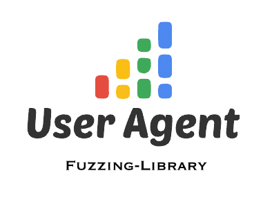

<p align="center">
  
</p>

<p align="center">
  
  
  <a href="https://shields.io/"></a>
  
  
  
  
  
  
  
</p>

# UserAgent Fuzzing Library

Version 3.0.0 is a JSON user-agent library for proxy and application testing. The checked-in [`user_agents.json`](user_agents.json) can be used directly by any JSON-capable tool, including [Proxy_Bypass](https://github.com/Add3r/Proxy_Bypass).

Each record has five fields: `title`, `group`, `id`, `user-agent`, and `platform`. Browser records use `General` or `Mobile`; AI records use `AI` and the shared `AI-Agents` group.

## Overview

**Primary uses**

- Refresh and maintain a fuzzing library of browser and AI HTTP User-Agent values.
- Consume the JSON data directly in security research, proxy testing, or other automation.
- Look up records by group or platform without re-scraping the sources.

**Included tools**

- [`ua-fuzz-lib.py`](ua-fuzz-lib.py) refreshes the combined JSON library.
- [`ua-stats.py`](ua-stats.py) creates charts and word clouds from the saved data.

## How to use the library

Clone the repository and install its dependencies:

```bash
git clone https://github.com/Add3r/UserAgent-Fuzz-lib.git
cd UserAgent-Fuzz-lib
python3 -m venv venv
source venv/bin/activate
python3 -m pip install -r requirements.txt
```

The committed `user_agents.json` is ready to use immediately. To refresh it from the sources, set a Cloudflare Radar API token for the AI data and run the updater:

```zsh
read -s "CLOUDFLARE_API_TOKEN?Cloudflare API token: "
export CLOUDFLARE_API_TOKEN
echo
python3 ua-fuzz-lib.py
```

The updater collects browser records and AI HTTP User-Agent values before asking whether to print them or replace `user_agents.json`. If a source fails, the saved JSON file is left unchanged.

## Example record

```json
{
  "title": "ABrowse 0.6",
  "group": "ABrowse",
  "id": "ua-1",
  "user-agent": "Mozilla/5.0 (compatible; U; ABrowse 0.6; Syllable) AppleWebKit/420+ (KHTML, like Gecko)",
  "platform": "General"
}
```

## Sample updater result

```text
$ python3 ua-fuzz-lib.py
Do you want to print the data on the screen? (yes/no): no
[!] Data was not printed on the screen.
Do you want to update the combined JSON file? (yes/no): yes
[+] user_agents.json updated successfully.
[+] New User-Agent records: 0
[+] General User Agents: 10474
[+] Mobile User Agents: 626
[+] AI User Agents: 70
[+] Total User Agents: 11170
```

## Statistics and sample results

Use the statistics tool to explore the saved library:

```bash
python3 ua-stats.py
```

It offers General and Mobile group charts, word clouds, platform totals, and AI bot charts:

```text
Select an option:
1. Mobile groups (count < 10)
2. Mobile groups (10 <= count < 500)
3. General groups (10 <= count < 50)
4. General groups (50 <= count < 500)
5. General groups (count >= 500)
6. Mobile group word cloud
7. General group word cloud
8. AI bots with most header variants
9. AI bot name word cloud
10. All platforms
11. AI bots by number of header variants
12. All AI User-Agent titles by record count
13. Exit
```

### Browser user-agent samples

<p align="center">
  <strong>Highest Mobile User Agents</strong><br>
  
</p>

<p align="center">
  <strong>Mobile User Agents with fewer than 500 records</strong><br>
  
</p>

<p align="center">
  <strong>Highest General User Agents</strong><br>
  
</p>

<p align="center">
  <strong>General User Agents with more than 500 records</strong><br>
  
</p>

<p align="center">
  <strong>General User Agents with fewer than 500 records</strong><br>
  
</p>

### AI user-agent samples

<p align="center">
  <strong>AI bot names by header variants</strong><br>
  
</p>

<p align="center">
  <strong>AI User-Agent titles by record count</strong><br>
  
</p>

## AI user-agent source

AI records are refreshed from the Cloudflare Radar Bots API for the `AI_CRAWLER`, `AI_ASSISTANT`, and `AI_SEARCH` categories. Entries without a concrete HTTP User-Agent or that are obvious templates are skipped. A token with **Account → Radar → Read** permission is required only when refreshing the library; consumers of the committed JSON do not need one.

## License

This project is licensed under the GPL-3.0 License; see [LICENSE](LICENSE).
